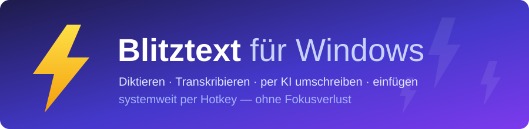

<div align="center">



**Hotkey halten → sprechen → der Text landet fertig formuliert an der Cursor-Position.**


[**⬇️ Download**](https://github.com/edo-dzell/blitztext-app-windows/releases/latest) ·
[Vergleich zum Original](#-stark-erweitert-windows-port-vs-macos-original) ·
[Screenshots](#-screenshots) ·
[Schnellstart](#-schnellstart) ·
[Selbst bauen](#-aus-dem-quellcode-bauen)

</div>

---

## ⚡ Was ist Blitztext für Windows?

Eine Speech-to-Text-Tray-App: Hotkey gedrückt halten, sprechen, loslassen — Blitztext transkribiert
das Diktat, schreibt es auf Wunsch per LLM um (sauberer formuliert, entschärft oder mit Emojis) und
fügt das Ergebnis direkt in der App ein, in der du gerade arbeitest. Ohne Fokusverlust, ohne
Kopieren-Einfügen von Hand.

Das Projekt ist ein **eigenständiger, stark erweiterter Windows-Neuschrieb** der bewusst klein
gehaltenen, experimentellen macOS-Menubar-App
[`cmagnussen/blitztext-app`](https://github.com/cmagnussen/blitztext-app) — gleiche Grundidee,
aber als vollwertige Windows-App mit deutlich größerem Funktionsumfang (siehe
[Vergleich](#-stark-erweitert-windows-port-vs-macos-original)).


Cloud-Aufrufe laufen ausschließlich über **deinen eigenen API-Key** direkt zum gewählten Anbieter —
kein eigenes Backend, keine Konten, keine Telemetrie. Schlüssel liegen lokal verschlüsselt
(Windows DPAPI via Electron `safeStorage`), nie im Klartext. Lässt sich eine verschlüsselte Datei
einmal nicht mehr entschlüsseln — etwa nach einem Profilwechsel —, wird sie als `.korrupt`
beiseitegelegt und gemeldet, statt beim nächsten Diktat überschrieben zu werden.

Beim Einfügen achtet Blitztext auf den Fokus: Wechselst du während der Verarbeitung das Fenster,
wird der Text **nicht** blind irgendwohin getippt, sondern landet mit einem Hinweis in der
Zwischenablage. Diktate werden zudem vom Windows-Zwischenablageverlauf ausgenommen, und schlägt ein
Lauf am Netz oder Anbieter fehl, lässt er sich mit einem Klick erneut verarbeiten — ohne neu zu
diktieren (das Audio bleibt dafür nur flüchtig im Arbeitsspeicher, nie auf der Platte).

## 🆚 Stark erweitert: Windows-Port vs. macOS-Original

Das Original beschreibt sich selbst als „intentionally small and unfinished“. Dieser Port baut die
Idee zur Alltags-App aus:

| | 🪟 **Blitztext für Windows** | 🍎 macOS-Original |
|---|---|---|
| **Fertige App** | ✅ Portable `.exe` je Release — CI-gebaut, mit `SHA256SUMS` + Build-Provenance | ❌ Nur Selbstbau (Xcode 16, XcodeGen) |
| **KI-Anbieter** | ✅ OpenAI, Groq, Mistral **und beliebige OpenAI-kompatible Endpunkte** | Nur OpenAI |
| **Lokale Transkription** | ✅ Keylose lokale Endpunkte (z. B. whisper.cpp, Speaches) — ganz ohne Cloud | WhisperKit/CoreML (Modell manuell installieren) |
| **API-Key-Verwaltung** | ✅ Ein Key **pro Anbieter**, verschlüsselt per Windows DPAPI | Eigener OpenAI-Key |
| **Workflows** | ✅ Die vier Klassiker **plus eigene Workflows** mit eigenen Prompts (z. B. Übersetzen DE → EN) | 4 feste Workflows |
| **Sprachen** | ✅ Eingabe- und Ausgabesprache pro Workflow aus 23 Sprachen — auf Deutsch diktieren, z. B. auf Englisch einfügen | — |
| **Ton & Emojis** | ✅ Pro Workflow regelbar: Ton (formal/neutral/locker) und Emoji-Dichte (aus–viel) — auch bei eigenen und auf statischen Text umgestellten Prompts | — |
| **Prompt-Editor** | ✅ Prompts anpassen, mit Versions-Historie und Wiederherstellen | — |
| **Verlauf** | ✅ Alle Diktate mit Kosten, Datum, Sortierung und Löschen — inkl. Prompt-Stand und **tatsächlich gelaufenem Modell** je Eintrag (nicht dem konfigurierten: wird ein Modell ersetzt, steht das ersetzte dort); gewählte Sortierung bleibt über einen Neustart hinweg erhalten | — |
| **Statistik** | ✅ Token-Summen und Kosten, mit editierbarer Preistabelle | — |
| **Design** | ✅ Hell/Dunkel (nach System oder manuell), Tray-Icon folgt dem Theme | — |
| **Diktier-UX** | ✅ Fokusfreie Status-Pille (bricht lange Fehlermeldungen um, statt sie abzuschneiden), Abbrechen jederzeit, Tray-Menü, Hotkeys frei belegbar, Mikrofon wählbar. Das Mikrofon wird beim Start vorgewärmt und bleibt es — auch die **erste** Aufnahme setzt sofort ein. Die Pille zeigt „Starte …“, bis wirklich aufgenommen wird, und bleibt bei Mehrmonitor-Betrieb auf dem Bildschirm, auf dem das Diktat begann | Menubar-Icon |
| **Live-Feedback** | ✅ Erneuter-Versuch-Kennzeichnung bei Audio-Retry, „dauert länger als üblich"-Hinweis bei langsamen Läufen, dezenter Status-Punkt im Einstellungsfenster während ein Diktat läuft | — |
| **Sicheres Einfügen** | ✅ Prüft vor dem Einfügen, ob noch dasselbe Fenster im Fokus ist — bei Fokuswechsel wird **nicht** blind getippt, sondern der Text landet in der Zwischenablage mit Hinweis. Steuerzeichen werden gefiltert; Diktate bleiben aus dem Windows-Zwischenablageverlauf | — |
| **Zuverlässigkeit** | ✅ Schlägt die Transkription fehl (Netz/Anbieter), lässt sich die Aufnahme mit einem Klick erneut verarbeiten — ohne neu zu diktieren (Audio nur flüchtig im RAM, nie auf Platte). Scheitert der Mikrofon-Zugriff, erscheint der Fehler **sofort** in der Status-Pille statt still zu verpuffen; abgestürzte interne Fenster (Aufnahme/Pille) heilen sich selbst; ein sterbender Einfüge-Helfer kann die App nicht abstürzen lassen (sauberer Zwischenablage-Fallback). Wird ein Mikrofon mitten in der Aufnahme abgezogen oder stummgeschaltet, meldet sich das **sofort** statt minutenlang stumm zu bleiben. Und die App schweigt nicht mehr: fehlender API-Key, gelöschter Workflow oder ein ersetztes Modell werden auch bei Hotkey-Auslösung gemeldet | — |
| **Komfort** | ✅ Autostart mit Windows, Selbstdiagnose (Mikrofon/Key/Anbieter/Hotkey als Ampel), optionaler Update-Hinweis im Tray (kein Auto-Update, keine Telemetrie), ehrlicher Hinweis beim Speichern während einer laufenden Aufnahme, atomar geschriebene Einstellungen (ein Absturz beim Speichern zerstört die `settings.json` nicht; ist sie doch beschädigt, wird sie als `settings.json.korrupt` gerettet statt still auf Werkseinstellungen zurückgesetzt) | — |
| **Härtung** | ✅ Prompt-Injection-Schutz + Treue-Detektor (erkennt, wenn das Modell das Diktat *beantwortet* oder stillschweigend Aussagen weglässt statt es originalgetreu umzuschreiben, und weist ehrlich darauf hin statt den Verlust zu verschleiern), Hotkey-Selbstheilung nach Sperrbildschirm/UAC, 1371 automatisierte Tests als CI-Gate | Experimentell, ohne Releases |
| **Diagnose-Log** | ✅ Lokales, **text-freies** Ereignislog für die Fehlersuche (nie Diktate, Texte oder API-Keys — nur Ereignisse, Dauern, Längen); verlässt nie das Gerät, ~1-MB-Deckel, Debug-Stufe per Schalter, Ordner-öffnen/Löschen in den Einstellungen | — |
| **Wörterbuch** | ✅ Eigene Begriffe (Namen, Fachwörter) per Chips-Editor hinterlegen, damit die Transkription sie korrekt schreibt — inkl. Budget-Anzeige; ein Begriff lässt sich direkt aus dem Verlauf heraus übernehmen. Die Übergabe erfolgt im jeweils **richtigen Feld des Anbieters** (Whisper und Voxtral erwarten Unterschiedliches) | — |
| **Verlauf: Änderungen zeigen** | ✅ Auf Wunsch ein Wortvergleich zwischen Rohdiktat und umgeschriebenem Text je Verlaufseintrag | — |
| **Einrichtung** | ✅ Einrichtungs-Assistent führt beim allerersten Start durch Anbieterwahl und API-Key | Manuelle Konfiguration |
| **Lokal-Vorlage & Server-Ampel** | ✅ Eigene Anbieter-Vorlage „Lokal (kein API-Key)“ mit Server-Ampel (zeigt, ob der lokale Endpunkt erreichbar ist) | — |
| **Alles einstellbar** | ✅ Jede Stellschraube sitzt unter „Einstellungen" — ausschließlich als Schalter oder Auswahlfeld, nichts zum Vertippen: Stille-Erkennung, Netzwerk-Zeitlimit, Wiederholungsversuche, Mindest-Aufnahmedauer, Verlaufs-Obergrenze, Statistik-Kompaktierung, Update-Intervall, Anzeigedauer der Status-Pille, Fokus-Sicherung. Jede Änderung wirkt sofort, ohne Neustart | — |
| **Gewartete Plattform** | ✅ Electron 43 (Chromium 150) — innerhalb des Sicherheits-Support-Fensters, nicht auf einer abgehängten Version stehen geblieben | — |
| **Workflows teilen** | ✅ Eigene Workflows als Preset-Datei exportieren und bei anderen Installationen wieder importieren | — |

<sup>Vergleich auf Basis des öffentlichen README des Originals (Stand Juni 2026).</sup>

## 📸 Screenshots

<table>
  <tr>
    <td colspan="2" align="center"></td>
  </tr>
  <tr>
    <td align="center"></td>
    <td align="center"></td>
  </tr>
</table>
<p align="center"><sup>Übersicht mit aktiven Hotkeys · Workflow-Editor · Nutzungs- und Kostenstatistik<br>
(Screenshots aus einer älteren Version — spiegeln nicht jedes neue Feature dieses Releases wider)</sup></p>

## ⬇️ Download & erster Start

Fertige, portable Windows-`.exe` — kein Installer, kein Admin nötig:

➡️ **[Neuestes Release herunterladen](https://github.com/edo-dzell/blitztext-app-windows/releases/latest)** → unter „Assets“ die `.exe`.

> **Hinweis:** Die Releases sind derzeit **unsigniert** (siehe
> [Code-Signing](#-code-signing--datenschutz)). Beim ersten Start zeigt Windows SmartScreen ggf.
> „Unbekannter Herausgeber“ → „Weitere Informationen“ → „Trotzdem ausführen“. Jedes Release enthält
> `SHA256SUMS.txt` und eine GitHub-Build-Provenance zum Verifizieren.

## 🔏 Code-Signing & Datenschutz

Die Releases sind aktuell **nicht code-signiert**. Windows zeigt beim ersten Start daher eine
SmartScreen-Warnung („Unbekannter Herausgeber“); das ist zu erwarten und kein Fehler.

Für kostenlose Code-Signierung wurde ein Antrag bei der [SignPath
Foundation](https://signpath.org/) gestellt (kostenlose Signierung für Open-Source-Projekte durch
eine gemeinnützige Drittinstanz). Stand Juli 2026: **abgelehnt** — nicht wegen Qualitätsmängeln,
sondern weil das Programm bestimmte externe Sichtbarkeits-Signale voraussetzt (u. a. GitHub-Stars/
Forks, unabhängige Erwähnungen, eine gewisse Nutzerbasis), die dieses noch junge Projekt bisher
nicht erfüllt. Eine erneute Bewerbung ist vorgesehen, sobald das Projekt gewachsen ist — ein ⭐ für
dieses Repo hilft dabei.

Bis dahin bleibt die Herkunft jedes Builds über die beiden folgenden Wege überprüfbar:

- Jedes Release-Artefakt (portable `.exe`) wird von GitHub Actions auf GitHub-gehosteten Runnern
  aus diesem Repository gebaut ([release.yml](.github/workflows/release.yml)) — keine manuell
  hochgeladenen Binaries.
- Jedes Release ist über `SHA256SUMS.txt` (Prüfsumme) und GitHub Artifact Attestations
  (Build-Provenance) unabhängig verifizierbar.

**Integrität vor dem ersten Start prüfen** (jedem Release beigelegt):

```powershell
# Prüfsumme gegen die beigelegte SHA256SUMS.txt vergleichen (PowerShell)
Get-FileHash .\Blitztext-<version>-win-portable.exe -Algorithm SHA256
# alternativ mit Bordmitteln älterer Windows-Versionen:
certutil -hashfile .\Blitztext-<version>-win-portable.exe SHA256
```

```bash
# Build-Provenance prüfen (GitHub CLI): bestätigt, dass die .exe aus diesem Repo per CI gebaut wurde
gh attestation verify Blitztext-<version>-win-portable.exe --repo edo-dzell/blitztext-app-windows
```

Den berechneten Hash mit dem passenden Eintrag in der beigelegten `SHA256SUMS.txt` vergleichen —
stimmen beide überein, ist die Datei unverändert.

**Datenschutz:** Blitztext sammelt keine Nutzerdaten und sendet keine Telemetrie. Diktat-Audio
geht ausschließlich an die vom Nutzer selbst konfigurierten Anbieter (eigener API-Key) oder an
einen lokalen Endpunkt; Einstellungen, Verlauf und API-Keys bleiben lokal auf dem Rechner.

**Diagnose-Log (ab v0.7.2):** Für die Fehlersuche schreibt Blitztext ein lokales Ereignislog nach
`%APPDATA%\blitztext-app\logs`. Es ist bewusst **text-frei**: Es enthält nie Diktate, Roh- oder
Endtexte, eingefügte Texte, Prompts oder API-Keys — nur Ereignisnamen, Dauern, Zeichen-Längen,
Fehlerklassen und gekürzte Fehlermeldungen. Das Log verlässt nie das Gerät (kein Upload), wechselt
bei ~1 MB auf genau eine Vorgänger-Datei und lässt sich in den Einstellungen unter
**System & Diagnose** einsehen („Log-Ordner öffnen") und jederzeit löschen. Dort sitzt auch der
Schalter **„Ausführliches Protokoll (Debug)"** für zusätzliche Detail-Zeilen; alternativ erzwingt
die Umgebungsvariable `BLITZTEXT_DEBUG=1` die Debug-Stufe.

## 🚀 Schnellstart

1. `.exe` starten — Blitztext legt sich ins Tray.
2. In den **Einstellungen** einen Anbieter wählen und deinen API-Key hinterlegen
   (oder einen lokalen, keylosen Endpunkt eintragen).
3. **Hotkey halten, sprechen, loslassen** — der Text erscheint an der Cursor-Position.

Die vier eingebauten Workflows:

| Workflow | Was er tut |
|---|---|
| ⚡ **Blitztext** | Nur transkribieren — das pure Diktat |
| ✨ **Blitztext+** | Roh-Diktat zu sauberem Text polieren (treu zum Original) |
| 😤 **Blitztext $%&!** | Frust-Tirade in eine ruhige, sendbare Nachricht umformulieren |
| 😊 **Blitztext :)** | Passende Emojis ins Diktat einstreuen |

Dazu beliebige **eigene Workflows** mit eigenem Prompt, Ton- und Emoji-Stufe.

## 📦 Workflow-Presets

Fertige Workflows zum Importieren statt selbst zu formulieren: `.json`-Datei aus `presets/<name>/`
herunterladen, dann in der App **Workflows → Importieren…** auswählen. Presets sind normale
Preset-Dateien desselben Formats wie der eigene Workflow-Export — keine Sonderfunktion, kein Zwang,
sie zu nutzen.

| Preset | Kurzzweck | Ordner |
|---|---|---|
| Meeting-Notizen | Diktiertes Gedankenprotokoll in Stichpunkte + „Offene Punkte" gliedern | [`presets/meeting-notizen/`](presets/meeting-notizen/) |
| Übersetzer (Englisch) | Reine Übersetzung ins Englische, ohne Stilglättung oder Kürzung | [`presets/uebersetzer-en/`](presets/uebersetzer-en/) |
| Code-Kommentar | Diktat in einen knappen, technischen Kommentar-/Docstring-Text überführen | [`presets/code-kommentar/`](presets/code-kommentar/) |
| Sachlich & kurz | Kürzt bewusst auf die Kernaussagen — sachlich, ohne Floskeln | [`presets/sachlich-kurz/`](presets/sachlich-kurz/) |

Eigene Presets beisteuern? Siehe [`CONTRIBUTING.md`](CONTRIBUTING.md#presets-beitragen).

## 🧰 Aus dem Quellcode bauen

<details>
<summary><b>Voraussetzungen & Befehle anzeigen</b></summary>

### Voraussetzungen

- Node.js 22.12 oder neuer + npm (harte Untergrenze seit Vite 7; die CI nutzt 22, siehe [release.yml](.github/workflows/release.yml))
- Zielplattform Windows 10/11; Entwicklung auch unter Linux/WSL möglich
- Ein API-Key eines OpenAI-kompatiblen Anbieters (oder ein lokaler Endpunkt)

### Befehle

```bash
npm install          # Abhängigkeiten installieren
npm run dev          # App im Dev-Modus starten (Tray + Fenster, HMR) — nur unter Windows lauffähig
npm test             # Vitest einmalig ausführen
npm run typecheck    # TypeScript prüfen, ohne zu bauen
npm run build        # Produktions-Bundle nach out/
npm run package:win  # portable Windows-`.exe` nach release/ bauen (unsigniert, einzelne Datei);
                     # baut zuvor das win-paste.exe-Helferprogramm (mingw-w64 Cross-Build)
```

> Die GUI ist nur unter Windows lauffähig; in einer Linux/WSL-Sandbox startet die Electron-GUI nicht
> (Chrome-Sandbox). Logik-Verifikation dort über `npm test` / `npm run typecheck` / `npm run build`.

</details>

## 🏗️ Architektur

**Stack:** Electron 43 · React 19 · TypeScript · Vite 7 (electron-vite 5) · Vitest 3 · Tailwind v4

<details>
<summary><b>Projektstruktur anzeigen</b></summary>

```text
src/
  main/      Electron Main-Prozess (Komposition, Sitzung, Runner, Provider, Secrets,
             Verlauf/Statistik, Hotkey, Tray/Fenster, IPC) — dazu Autostart,
             Selbstdiagnose (health/) und optionaler Update-Hinweis (update/)
  preload/   contextBridge-API zwischen Main und Renderer
  renderer/  React-Dashboard (Übersicht/Workflows/Verlauf/Statistik/Einstellungen/Über)
             + UI-Kit + versteckter Recorder + Status-Pille
  shared/    framework-unabhängige Domänendaten (workflows, providers, pricing, sprachen)
test/        Vitest-Tests
scripts/     Hilfsskripte (Tray-Icons, Release-Retention)
native/      win-paste.exe-Quelle (mingw-w64 Cross-Build): Einfügen, Fokus-Prüfung,
             Zwischenablage-Ausschluss
```

</details>

## ❓ FAQ & Problembehebung

<details>
<summary><b>Windows SmartScreen zeigt „Unbekannter Herausgeber" — ist das gefährlich?</b></summary>

Nein, das ist erwartbar: Die Releases sind (noch) nicht code-signiert — ein Antrag auf kostenlose
Signierung bei der SignPath Foundation wurde gestellt und (Stand Juli 2026) mangels ausreichender
externer Sichtbarkeit des Projekts abgelehnt, siehe [Code-Signing](#-code-signing--datenschutz).
Über „Weitere Informationen“ → „Trotzdem ausführen“ lässt sich die `.exe` trotzdem starten. Zur
Verifikation liegt jedem Release `SHA256SUMS.txt` bei (Prüfung z. B. mit `certutil -hashfile
<datei> SHA256` oder PowerShells `Get-FileHash`), und die Build-Provenance lässt sich per
`gh attestation verify` gegen dieses Repository prüfen (siehe oben).

</details>

<details>
<summary><b>Mein Antivirenprogramm schlägt bei der .exe Alarm — ist die Datei manipuliert?</b></summary>

Unsignierte Electron-`.exe`s lösen bei manchen Virenscannern Fehlalarme aus, das ist ein bekanntes
Muster bei unsignierten Windows-Binaries generell und kein Hinweis auf eine manipulierte Datei.
Prüfe die Prüfsumme gegen `SHA256SUMS.txt` und die Build-Provenance (`gh attestation verify`, siehe
oben) — beides bestätigt, dass die Datei unverändert aus dem CI-Lauf dieses Repositories stammt.

</details>

<details>
<summary><b>Blitztext erkennt kein Mikrofon</b></summary>

Prüfe zuerst die Windows-Mikrofonberechtigung für Desktop-Apps (Einstellungen → Datenschutz &
Sicherheit → Mikrofon). Die App bringt außerdem eine Selbstdiagnose („Ampel“) in den Einstellungen
mit, die Mikrofon, API-Key, Anbieter-Erreichbarkeit und Hotkey-Erkennung einzeln prüft und bei
fehlendem oder nicht ermittelbarem Mikrofon einen konkreten Hinweis anzeigt. Scheitert der
Mikrofon-Zugriff erst, während du die Aufnahme-Taste gedrückt hältst, erscheint der Fehler seit
v0.7.3 **sofort in der Status-Pille** — kein stiller Fehlschlag mehr.

</details>

<details>
<summary><b>Etwas funktioniert nicht — wo finde ich Logs für einen Fehlerbericht?</b></summary>

Seit v0.7.2 führt Blitztext ein lokales Ereignislog unter `%APPDATA%\blitztext-app\logs`
(in den Einstellungen unter **System & Diagnose** per Knopf „Log-Ordner öffnen" erreichbar).
Es ist text-frei — Diktate, eingefügte Texte und API-Keys landen nie darin — und eignet sich
daher gefahrlos als Anhang für einen GitHub-Issue. Für besonders detailreiche Zeilen vor dem
Reproduzieren des Problems den Schalter „Ausführliches Protokoll (Debug)" aktivieren und speichern.

</details>

<details>
<summary><b>Autostart mit Windows funktioniert nach dem Verschieben der .exe nicht mehr</b></summary>

Erwartbar bei einer portablen `.exe` ohne Installer: Der Autostart-Eintrag zeigt auf den exakten
Pfad zum Zeitpunkt des Aktivierens. Wird die `.exe` danach verschoben oder umbenannt, erkennt die
App den Eintrag als „verwaist“ statt ihn fälschlich als aktiv auszugeben — einfach in den
Einstellungen einmal neu aktivieren, dann zeigt der Eintrag wieder auf den aktuellen Pfad.

</details>

## 📄 Lizenz & Credits

MIT — siehe [`LICENSE`](./LICENSE). Dieses Projekt ist ein eigenständiger Windows-Neuschrieb des
macOS-Originals [`cmagnussen/blitztext-app`](https://github.com/cmagnussen/blitztext-app); dessen
Urheberrechtsvermerk ist gemäß MIT-Lizenz im `LICENSE` erhalten. Danke an das Original für die
Idee und die vier Workflow-Klassiker. ⚡

Beiträge willkommen — siehe [`CONTRIBUTING.md`](./CONTRIBUTING.md). Sicherheitslücke gefunden?
Bitte [`SECURITY.md`](./SECURITY.md) beachten (kein öffentliches Issue mit sensiblen Details).
